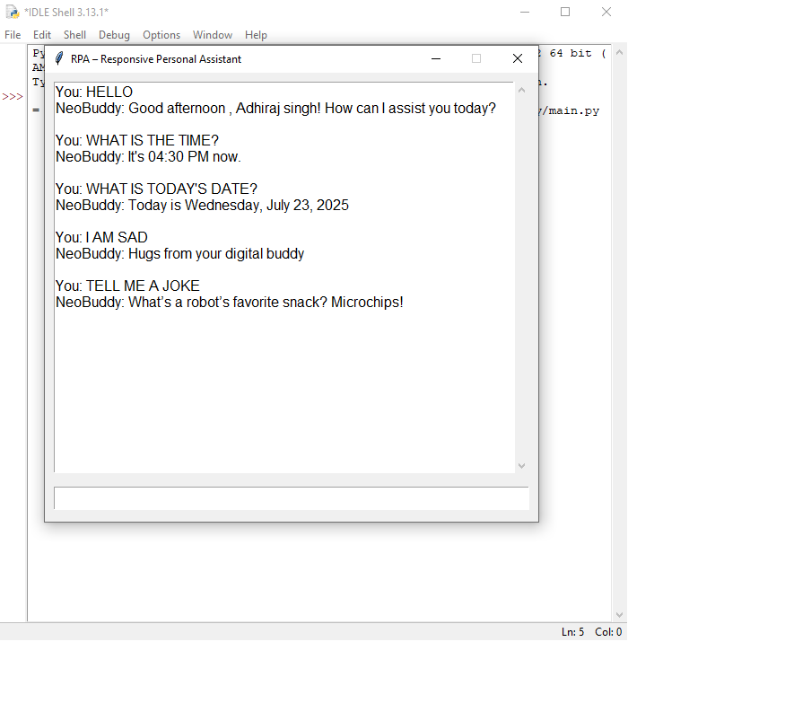

# RPA – Rule-Based Personal Assistant Chatbot

**RPA (Responsive Personal Assistant)** is an ultra-responsive, rule-based chatbot developed using Python. It simulates intelligent and context-aware conversation without relying on machine learning or external APIs. Designed as a modular, memory-enabled assistant, RPA can handle various user queries and respond in real-time with precision and personality.

This is my first full-scale project aimed at combining real-world usefulness with simplicity and speed — part of my long-term vision to create human-compatible AI systems.

---

##  Features

-  **Rule-Based Engine** – Fast and simple logic-driven conversation handling
-  **Ultra Responsive** – Built for speed and accuracy
-  **Memory System** – Remembers user-specific information (like name/preferences)
-  **Customizable Rules** – Easily extend logic using a JSON file
-  **Expandable UI** – CLI by default, GUI (Tkinter/Flask) optional

---

##  Tech Stack

- Python 3.9+
- JSON (for rules and memory)
- Tkinter or Flask (optional GUI version)

---

##  Demo Screenshot

Here’s how RPA looks in action:

